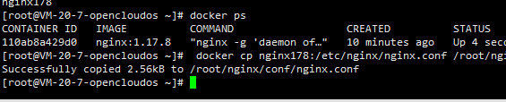

<!--
 * @Date: 2024-08-03 19:38:34
 * @LastEditors: likai 2806699104@qq.com
 * @FilePath: \html-test\public\Docker\md\部署.md
 * @Description: Do not edit
-->

# 1. CenterOS

<!-- TOC -->

- [1. CenterOS](#1-centeros)
- [2. nginx 安装](#2-nginx-安装)
- [3. docker](#3-docker)
    - [3.1. docker-nginx](#31-docker-nginx)
    - [docker-minio](#docker-minio)
    - [3.2. docker-镜像操作](#32-docker-镜像操作)
- [2. docker-compose](#2-docker-compose)
- [3. docker - nginx](#3-docker---nginx)
- [4. user  nobody;](#4-user--nobody)

<!-- /TOC -->


# 2. nginx 安装

nginx 服务没有安装。您可以通过包管理器（如 yum ）来安装 nginx 。
对于 CentOS 系统，使用以下命令安装：
sudo yum install nginx

在 CentOS 系统中，使用 sudo yum install nginx 安装完 Nginx 后，可以通过以下命令启动 Nginx 服务：
sudo systemctl start nginx

如果您想让 Nginx 服务在系统启动时自动启动，可以使用以下命令：
sudo systemctl enable nginx

要检查 Nginx 服务的状态，可以使用：


要停止 Nginx 服务，可以使用：
sudo systemctl stop nginx

要删除 Nginx 服务，可以使用：
sudo yum remove nginx


# 3. docker
安装 Docker
首先，确保您的系统上已经安装了 Docker。您可以参考 Docker 官方文档获取适合您操作系统的安装指南。

## 3.1. docker-nginx 

 ### 拉取镜像 查看版本
在终端或命令提示符中，运行以下命令来拉取最新的 Nginx 官方镜像：
docker pull nginx
docker pull nginx:1.17.8 # 指定版本
查看版本 docker images

 ### 在root创建nginx文件夹
 mkdir -p /root/nginx/html
 mkdir -p /root/nginx/conf 
 mkdir -p /root/nginx/logs

 ### 运行 nginx 容器 
sudo docker run --name nginx178 -p 9091:80 -d nginx:1.17.8

docker stop nginx178 # 停止 --name nginx178  容器 或者 docker stop 110ab8a429d0

要重新运行之前使用 docker stop 命令停止的名为 nginx178 的容器，您可以使用以下命令：
docker start nginx178

要删除名为 nginx178 的容器，您可以使用以下命令：
docker rm nginx178

 1. 启动nginx178 容器 
``` java
  docker start nginx178
  docker ps
```
 2. 拷贝配置文件 
 如果您需要将容器内的文件或目录拷贝到本地，使用以下命令格式：
 ``` cmd
 # 从容器复制到本地-》》 前提容器需要启动
 docker cp 容器名称:容器内路径 本地路径
 docker cp nginx178:/etc/nginx/nginx.conf /root/nginx/conf/nginx.conf
 ```
 ``` cmd
 # 从本地复制到容器
 docker cp /root/nginx/conf/nginx.conf nginx178:/etc/nginx/nginx.conf
 chmod 600 /root/server/nginx/conf/nginx.conf # 修改权限 
 chmod 700 /root/server/nginx/conf/nginx.conf # 修改权限 777
 docker restart nginx178
 ```


 3. 映射端口映射

``` cmd
   docker run -d -p 9099:99  -p 80:80 -p 443:443 --name nginx178 -v /root/nginx/html:/usr/share/nginx/html -v /root/nginx/conf/nginx.conf:/etc/nginx/nginx.conf -v /root/nginx/logs:/var/log/nginx --privileged=true nginx:1.17.8
```
   -v /root/nginx/cache:/var/cache/nginx \  # 映射缓存目录   需要提前创建


以下是对这个 `docker run` 命令的详细解释：

- `-d`：表示以守护式（后台）模式运行容器。
- `-p 9091:80`：将主机的 9091 端口映射到容器内的 80 端口，即外部可以通过访问主机的 9091 端口来访问容器内 Nginx 服务的 80 端口。
- `--name nginx`：为容器指定名称为 `nginx` 。
- `-v /root/server/nginx/html:/usr/share/nginx/html`：将本地的 `/root/server/nginx/html` 目录挂载到容器内的 `/usr/share/nginx/html` 目录，实现文件共享。
- `-v /root/server/nginx/conf/nginx.conf:/etc/nginx/nginx.conf`：将本地的 Nginx 配置文件 `/root/server/nginx/conf/nginx.conf` 挂载到容器内的 Nginx 配置文件路径 `/etc/nginx/nginx.conf` ，从而使用本地自定义的配置。
- `-v /root/server/nginx/logs:/var/log/nginx`：将本地的 `/root/server/nginx/logs` 目录挂载到容器内的 Nginx 日志目录 `/var/log/nginx` ，方便在本地查看和管理日志。
- `--privileged=true`：给予容器特权权限。
- `nginx:1.17.8`：指定要使用的 Nginx 镜像版本为 1.17.8 。

总结来说，是将主机的端口、本地的目录与容器内相应的路径进行映射和关联，以实现自定义配置、文件共享和日志管理等功能。 


 ### 停止当前正在运行的 Nginx 容器（如果正在运行）
```cmd
   docker stop nginx178 # 停止 --name nginx178  容器 或者 docker stop 110ab8a429d0
   docker rm nginx178 || docker rm -f nginx178 # 删除容器
   docker restart nginx
```
 ### hosts 配置
 127.0.0.1  www.example.com

 ### nginx.conf 配置
 

## docker-minio
 1. 创建文件夹
 mkdir -p /root/minio/data
 2. 拉取镜像
docker pull minio/minio
 3. 运行容器 minio
docker run -d -p 9000:9000 -p 9001:9001 -v /root/minio/data:/data -v /root/minio/config:/root/.minio --name minio -e "MINIO_ACCESS_KEY=your_access_key" -e "MINIO_SECRET_KEY=your_secret_key" minio/minio server /data --console-address ":9001"

``` cmd

```

以下是对该代码的完整介绍：

- `docker run`：用于启动一个新的 Docker 容器。
- `-d`：表示以守护式（后台）模式运行容器，使其在后台持续运行。
- `-p 9000:9000`：将容器内的 9000 端口映射到主机的 9000 端口，用于对外提供服务。
- `-p 9001:9001`：将容器内的 9001 端口映射到主机的 9001 端口，可能用于其他相关功能，如控制台访问。
- `-v /root/minio/data:/data`：将主机上的 `/root/minio/data` 目录挂载到容器内的 `/data` 目录，用于数据存储。
- `-v /root/minio/config:/root/.minio`：将主机上的 `/root/minio/config` 目录挂载到容器内的 `/root/.minio` 目录，可能用于配置文件的存储。
- `--name minio`：为容器命名为 `minio`，方便后续对容器的管理和识别。
- `-e "MINIO_ACCESS_KEY=your_access_key"`：设置环境变量 `MINIO_ACCESS_KEY` 的值为 `your_access_key`，这可能是 MinIO 的访问密钥。
- `-e "MINIO_SECRET_KEY=your_secret_key"`：设置环境变量 `MINIO_SECRET_KEY` 的值为 `your_secret_key`，这可能是 MinIO 的秘密密钥，用于认证和授权。
- `minio/minio server /data --console-address ":9001"`：指定要运行的镜像为 `minio/minio`，并在容器内执行 `server /data --console-address ":9001"` 命令，启动 MinIO 服务器，并将数据存储在 `/data` 目录，同时将控制台地址设置为 `:9001`。

总的来说，这段代码的目的是启动一个 MinIO 容器，并进行端口映射、目录挂载和环境变量设置，以配置和运行 MinIO 服务。


 

## 3.2. docker-镜像操作
sudo docker run --name nginx178 -p 9091:80 -d nginx:1.17.8
docker stop nginx178 # 停止 --name nginx178  容器
要重新运行之前使用 docker stop 命令停止的名为 nginx178 的容器，您可以使用以下命令：
docker start nginx178
要删除名为 nginx178 的容器，您可以使用以下命令：
docker rm nginx178


# 2. docker-compose 
docker-compose up -d
使用 docker-compose down 命令来停止并删除容器、网络、卷等与该服务相关的资源。
docker-compose down


# 3. docker - nginx
docker run -d -p 80:80 -v /home/wwwroot/default:/usr/share/nginx/html nginx

version: "3"
services:
  nginx: # 服务名称，用户自定义
    image: nginx:latest  # 镜像版本
    ports:
      - 80:80  # 暴露端口
    volumes: # 挂载
      - /root/nginx/html:/usr/share/nginx/html
      - /root/nginx/nginx.conf:/etc/nginx/nginx.conf
    privileged: true # 这个必须要，解决nginx的文件调用的权限问题
  mysql:
    image: mysql:5.7.27
    ports:
      - 3306:3306
    environment: # 指定用户root的密码
      - MYSQL_ROOT_PASSWORD=admin
  redis:
    image: redis:latest
  server:
    image: server:latest
    build: . # 表示以当前目录下的Dockerfile开始构建镜像
    ports:
      - 8085:8085
    depends_on: # 依赖与mysql、redis，其实可以不填，默认已经表示可以
      - mysql
      - redis


# 4. user  nobody;
worker_processes 1;
events {
    worker_connections 1024;
}
http {
    include mime.types;
    default_type application/octet-stream;

    log_format main '$remote_addr - $remote_user [$time_local] "$request" '
    '$status $body_bytes_sent "$http_referer" '
    '$upstream_addr';

    sendfile on;
    keepalive_timeout 65;
    server {
        listen 80;
           server_name localhost 127.0.0.1 114.132.62.199;
        location / {
            root html/dist;
            try_files $uri $uri/ /index.html last;
            index index.html index.htm;
        }
        location /vueblog {
            proxy_pass http://114.132.62.199:8081;
            access_log logs/pointcloud.log main;
        }
    }

}
